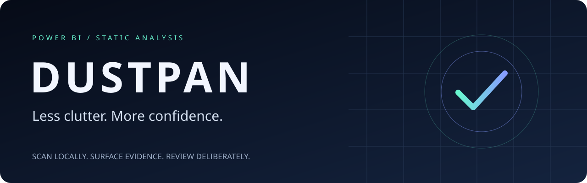
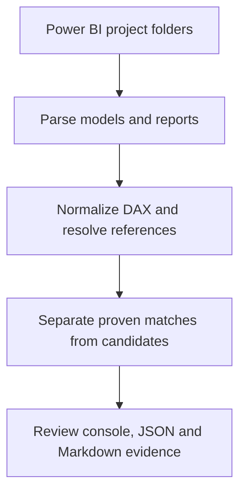

<p align="center"></p>

<p align="center">
  <a href="https://github.com/Santhosh0303/DUSTPAN/actions/workflows/ci.yml"></a>
  <a href="https://github.com/Santhosh0303/DUSTPAN/actions/workflows/release-checks.yml"></a>
</p>

<p align="center"><a href="#install">Start scanning</a> · <a href="#verification-dashboard">Explore verification</a> · <a href="CONTRACT.md">Read the safety contract</a> · <a href="https://github.com/Santhosh0303/DUSTPAN/issues">Report an issue</a></p>

# dustpan

## Less clutter. More confidence.

Your estate has hundreds of measures. Which ones deserve to stay?
Dustpan turns exported Power BI definitions into evidence for human review.
It does **not** delete measures, execute DAX, or prove business equivalence.



<details>
<summary><strong>Try the included demo</strong></summary>

```bash
python -m pip install -e .
python -m dustpan.cli scan tests/fixtures --markdown demo-report.md
```

Run this from the repository root. The fixtures are synthetic examples, not a
benchmark of a production estate. Review the findings before changing any model.

</details>

## Verification dashboard

| Gate | Evidence source |
| --- | --- |
| Six native test modules | Linux and Windows, Python 3.11 / 3.12, in Actions |
| 80 distinct Edge/OAT cases | Two 40-case matrices on Linux |
| Six safety-boundary probes | Dedicated Linux regression receipts |
| 30 bounded stress workloads | Dedicated Linux stress receipts |
| Package integrity | Source distribution tests and offline wheel installation |
| Dependencies | `pip check`, vulnerability audit, and Dependabot updates |
| Reproducibility | Two clean builds with fixed tooling, timestamp and canonical sdist metadata |

**Read the live Actions results, not this table, as the pass/fail verdict.**
Configured checks are not completed checks. Failed or pending gates mean the
release is not approved. POSIX fault-injection probes do not substitute for
Windows-native tests. Dependabot update runs are separate from test runs.

Release source distributions require `tools/canonical_sdist.py` after building:
the setuptools backend alone does not make tar/gzip metadata reproducible.
This stage preserves and verifies every file payload while normalizing archive
timestamps and owner metadata. Hash or sign only the resulting final archive.

<details>
<summary><strong>What does a conservative finding mean?</strong></summary>

A canonical duplicate is a match under Dustpan's documented normalization rules,
not a guarantee that two deployments have identical business behavior. An unused
candidate can still have consumers outside the scanned estate. Incomplete parsing
or uncertain report coverage must restrict actionable conclusions.

See [CONTRACT.md](CONTRACT.md) and [FIX-LEDGER.md](FIX-LEDGER.md) for the boundaries.

</details>

Public source visibility does not change the [project license](LICENSE).

**Subtractive analysis for Power BI estates.** Point it at a folder full of
`.pbip` projects; it extracts every measure, canonicalises the DAX, and
tells you which measures are exact duplicates, which look like duplicates
but aren't proven, and which nothing in your reports actually uses.

## The thesis

> Do real Power BI estates actually contain duplicate measure definitions?

Every BI practice has a folklore belief that its semantic models have
accumulated `Total Sales`, `Sales Total`, and `Sum of Sales` — three
measures, one number, written by three different people at three different
times who didn't know the others existed. dustpan exists to turn that
folklore into a number: run it against a real estate and find out whether
it's true, and by how much.

It is deliberately **subtractive**. It doesn't help you build anything; it
only tells you what you could remove, merge, or stop worrying about. If the
thesis is wrong — if a given estate turns out to be clean — that is a
useful, correct answer, not a failed run.

## The one rule everything else follows

**A false positive is worse than a false negative.** If dustpan tells you
two measures are duplicates and it's wrong, someone deletes a measure a
report still needs, and the report breaks. If dustpan misses a real
duplicate, the estate is exactly as messy tomorrow as it was yesterday —
mildly disappointing, never destructive.

So every finding below `confidence 1.0` is phrased as a *candidate*, never
as a fact, and the only thing dustpan will call proven is byte-for-byte
identical DAX after a canonicalisation it can defend line by line (see
[How duplicates are detected](#how-duplicates-are-detected) below).

## Install

Standard library only — **no third-party runtime dependencies, ever**. That
is a hard requirement, not a nice-to-have: the people who need this tool
are usually stuck on a locked-down corporate Windows laptop with no `pip`
access to the open internet. If it doesn't ship in a stock Python 3.11+, it
isn't in here.

**Windows (PowerShell or cmd, Python 3.11+ already installed):**

```powershell
cd dustpan
py -m pip install --user -e .
dustpan version
```

If your machine has no internet access at all (common on locked-down
estates), skip the install and run it in place instead:

```powershell
cd dustpan\src
py -m dustpan.cli scan "C:\Users\you\Power BI Projects" --markdown report.md
```

The `cd ...\src` matters: with no install, Python needs the directory that
actually contains the `dustpan` package on its path. Running this from the
repository root fails with `ModuleNotFoundError: No module named 'dustpan'`
(AUD-V3-025).

**Linux / macOS:**

```bash
cd dustpan
python3 -m pip install --user -e .
dustpan version
```

Or, again, with no install at all:

```bash
cd dustpan/src
python3 -m dustpan.cli scan ../MyProjects --markdown report.md
```

Or, equivalently, from the repository root with the path set explicitly:

```bash
cd dustpan
PYTHONPATH=src python3 -m dustpan.cli scan ./MyProjects --markdown report.md
```

Both are verified from a clean extraction with no inherited `PYTHONPATH`
and no installed copy; the plain `cd dustpan` form without either does not
work (AUD-V3-025).

The runtime uses only Python's standard library. On POSIX systems supporting
`O_NOFOLLOW` and descriptor-relative opens, reads enforce descriptor-bound
containment. Windows uses path-based checks and emits a material degradation
note, withholding proven-retirement advice. Treat input trees as trusted and
immutable there. Windows behavior and acceptance remain pending execution.

## Use

```bash
dustpan scan <path> [--json FILE] [--markdown FILE] [--quiet]
                     [--min-confidence FLOAT] [--fail-on-findings] [--no-color]
dustpan version
```

`<path>` is the folder that contains your `.pbip` project(s) — or any
ancestor of it. dustpan walks the whole tree, tolerant of nesting, so
pointing it at the root of a repo containing dozens of projects works
exactly the same as pointing it at one project's own folder.

```bash
dustpan scan ./MyProject                     # read the report in the terminal
dustpan scan ./MyProject --markdown out.md   # a report you can paste into a ticket
dustpan scan ./MyProject --json estate.json  # the full machine-readable dump
dustpan scan . --min-confidence 0.6          # hide the noisiest name-drift guesses
dustpan scan . --quiet --fail-on-findings    # CI gate: silent unless something's wrong
```

**Exit codes** (so it's safe to wire into a CI job):

| Code | Meaning |
|---|---|
| `0` | Scan completed. (Findings may exist — see `--fail-on-findings`.) |
| `1` | `--fail-on-findings` was given and at least one high-severity finding survived `--min-confidence` filtering. |
| `2` | Bad usage: no such path, path is a file not a folder, or an output file couldn't be written. |

## What it finds

Every finding carries a `confidence` between `0.0` and `1.0`.
**Confidence is defined per finding kind, and it measures how certain the
statement is -- not whether you may act on it.** `1.0` means the statement
is deterministic. Two kinds qualify, and they say different things:
`exact_duplicate` (these expressions are identical) and `unparsed` (this
measure definitively did not canonicalise). Neither is by itself permission
to delete anything (AUD-V3-025).

Whether a finding may carry a retirement instruction is a separate decision,
made by `pipeline.apply_actionability` over the current estate and reported
as `evidence["retirement_cleared"]`. A finding can be `1.0` and still be
refused -- because the members' display metadata differs, because no report
bound to that deployment was scanned, or because the scan is degraded.

| Confidence | Kind | What it means |
|---|---|---|
| **1.00** | `exact_duplicate` | Two or more measures canonicalise to byte-for-byte identical DAX. This is a deterministic fact, not a guess. |
| **~0.60** | `near_duplicate` ("same shape") | Different DAX, but the same table/column references and the same outermost aggregation function. Worth a human's ten minutes, never worth an automatic merge — `CALCULATE` filters and row context can make two "same-shaped" measures compute completely different numbers. |
| **~0.30** | `near_duplicate` ("possible definition drift") | Two measures whose *names* mean the same thing in English (`Total Sales` / `Sales Total`) but whose formulas are not identical. Lowest confidence, but arguably the most important finding a tool like this can produce: it's the one that says the same word means two different numbers depending who you ask. |
| **~0.60 / 0.40** | `unused_measure` | No visual in any scanned report references this measure, directly or through another measure. Confidence drops to 0.40 when the scan is missing information that would make the graph incomplete (unparsed measures, scan errors). |
| **0.00** | `usage_unknown` | *Informational.* No report/dashboard was scanned at all, so usage genuinely could not be assessed. Emitted instead of unused findings — reporting every measure "unused" because no reports were looked at would be the single most destructive thing this tool could do. |
| **1.00** | `unparsed` | dustpan could not canonicalise this measure's DAX. Not a judgement about the measure — a statement about dustpan's own coverage gap, so it never disappears silently. |

`exact_duplicate` is the only tier with an actionable "keep this one,
retire the others" recommendation, and even that comes with two caveats.

**Which one to keep is decided by actual usage, not alphabetical order.**
dustpan counts how many visuals across every scanned report reference each
member of a duplicate set, and keeps the most-referenced one; a measure
with at least one reference always beats one with none. Only when *no*
member of the set is referenced by anything dustpan scanned does it fall
back to a visible (non-hidden), then alphabetically-first measure — and
when that happens, it says so explicitly ("no member is referenced by any
scanned visual — keeper chosen arbitrarily for determinism") instead of
silently presenting an arbitrary pick as if it meant something. An earlier
build of this rule ignored usage entirely (hidden-then-alphabetical only),
which on this project's own fixture recommended keeping an *unused*
measure and retiring the one a live report visual actually pointed at —
exactly backwards, and exactly the kind of mistake that turns a
zero-effort cleanup into migration work.

The recommendation is also only offered when every member of the set lives
in the **same semantic model**. dustpan is meant to be pointed at a whole
folder of `.pbip` projects, so it's completely normal for two *unrelated*
models to both define `Total Sales = SUM(Sales[Amount])`. That's still a
true and interesting fact — worth a note about a shared/certified dataset
— but "retire B" is dangerous advice when A and B are independent models
feeding independent reports; deleting B doesn't retire whatever *other*
report still needs it to exist. Deployments are told apart by project root,
not by folder name (see [What this does not do
yet](#what-this-does-not-do-yet) for what that identity is and is not).

The headline stat is two numbers, never added together: **measures proven
removable** (exact duplicates only, confidence `1.0`, same-model — a
deterministic fact) and **candidates for review** (everything below
`1.0`: near-duplicate and unused-measure findings — a reading list, not a
delete list). An earlier version of this tool blended both into one "N
measures removable" percentage; that number was arithmetically correct and
substantively misleading, since it let a reader take a heuristic guess as
proven fact by osmosis. Splitting it was a deliberate fix.

## How duplicates are detected

The DAX canonicaliser (`dax/lexer.py` + `dax/normalise.py`) tokenises each
measure, then rewrites it to a single-line canonical form and hashes that
with SHA-256. The rewrite rules are deliberately narrow — each one is
something provably lossless in DAX:

- Comments (`//`, `--`, `/* */`) are stripped; whitespace and layout are
  collapsed entirely.
- Function names, keywords, table and column names are upper-cased
  (ASCII-only — folding `ß`→`SS` could merge two genuinely different
  names, so non-ASCII letters are left alone).
- `'Sales'[Amount]` and `Sales[Amount]` unify — same reference, different
  spelling.
- Numeric literals go through exact `Decimal` arithmetic, never `float`:
  `1`, `1.0`, `1.00`, `1e0` all agree.

And the rules explicitly **rejected** as unsafe, because each one would
turn a false positive into a possibility:

- **No sorting of function arguments, ever.** `DIVIDE(a, b) != DIVIDE(b, a)`.
  Order is semantically meaningful in DAX and this is non-negotiable.
- **No unwrapping function calls.** `CALCULATE(SUM(x), filter)` never
  reduces to `SUM(x)`; `SUMX(Sales, Sales[Amount])` never reduces to
  `SUM(Sales[Amount])`. Only tokens are rewritten — calls are never
  removed.
- **No stripping "redundant" parentheses.** Deciding a pair of parens is
  redundant needs a real parser, and getting it wrong silently changes
  precedence.
- **No `VAR` alpha-renaming.** `VAR x = 1 RETURN x` and `VAR y = 1 RETURN y`
  are left as different fingerprints. Correct renaming needs real scope
  analysis; the cost of not doing it is a handful of missed matches, which
  is the acceptable failure mode.
- **String literal content is never touched.** DAX compares strings
  case-insensitively at runtime, but a string is often shown to a report
  user, and `"UK"` is not `"uk"` on screen.
- **`=` and `==` stay distinct** — they differ on `BLANK()`.

The included test suite (`tests/test_dax.py`) is built around this list:
every rule that's applied has a "must match" pair proving it's safe, and
every rule that's rejected has a "must not match" pair proving the
canonicaliser doesn't quietly do it anyway.

## What counts as "used"

`detect/unused.py` builds a measure-to-measure dependency graph from every
`[BareReference]` inside every measure's DAX, then asks: is this measure
reachable from something a visual actually projects, filters, or sorts by?
A measure referenced only by *another measure's formula* is not unused —
missing that would be a false positive with real teeth.

The report parser (`parsers/report.py`) is deliberately promiscuous about
where a reference can appear: a value well, a page filter, a visual-level
filter, a report-level filter, a bookmark's saved selection state, a
report-level measure's own DAX body, a conditional-formatting rule — all
of them count as usage. Missing any one of these is exactly how a real
measure ends up mislabelled unused.

## Project layout

```
src/dustpan/
  ir.py                   frozen intermediate representation every module codes against
  parsers/
    discover.py            walks a folder tree, classifies PBIP parts
    tmdl.py                 *.SemanticModel/definition/*.tmdl -> Metric
    tmsl.py                  model.bim (TMSL JSON) -> Metric
    report.py                 report.json (legacy) and PBIR -> Asset/Visual
  dax/
    lexer.py                tokeniser: comments, strings, refs, operators, numbers
    normalise.py              canonical form + SHA-256 fingerprint
  detect/
    duplicates.py            exact / same-shape / name-drift tiers
    unused.py                 dependency graph + report-reference reachability
  pipeline.py                scan(root) -> Estate; wires everything together, degrades gracefully
  cli.py                      argparse entry point
  output/
    console.py               plain ASCII/ANSI terminal report
    writers.py                --json and --markdown output
tests/
  fixtures/                  planted PBIP projects (see CONTRACT.md)
  test_dax.py                 the adversarial DAX suite
  test_parsers_model.py        TMDL + TMSL parsing
  test_parsers_report.py        legacy report.json + PBIR reference extraction
  test_detect.py                 duplicate/unused detection tiers
  test_cli.py                     argument parsing, exit codes, output files
```

Every parser is contracted to **never raise** — malformed input is recorded
in `Estate.errors` and the scan continues with whatever it could read.
`pipeline.scan()` goes one step further and imports every collaborating
module lazily and defensively: a missing or half-written module degrades
that one stage of the analysis (and says so in the output) rather than
crashing the whole scan.

## Run the tests

```bash
pip install pytest --break-system-packages   # or into a venv, if you have one
python3 -m pytest tests/ -v
```

290 tests, no third-party runtime dependency required for dustpan itself
(pytest is a dev-only, test-time dependency).

## What this does not do yet

Being honest about the edges matters more here than almost anywhere else,
because the failure mode of overclaiming is someone trusting a finding
that isn't there yet:

- **No Power Query / M.** Calculated columns and transformations that live
  in a table's `partition ... = m` block are invisible to dustpan. If two
  "duplicate" measures actually differ because their *source columns* are
  computed differently upstream, dustpan cannot see that.
- **No calculation groups or calculation items.** These aren't measures in
  the TMDL/TMSL sense this tool understands, so they're silently absent
  from every scan rather than mis-parsed.
- **No RLS awareness.** A measure that looks "unused" by report visuals
  might still be referenced from a row-level-security filter expression,
  which dustpan does not currently scan.
- **No cross-tool usage signal.** dustpan only sees the files under the
  path you point it at. A measure consumed by Excel's Analyze-in-Excel, a
  paginated report, Power BI Q&A, an XMLA-endpoint client (Tabular Editor,
  a Python/R script, a partner tool), or a *different* report you didn't
  include in the scan will look unused here. The `usage_unknown` finding
  and every `unused_measure` finding's evidence say this caveat out loud;
  it is never left implicit.
- **Deployment identity is derived from the filesystem, not from a certified
  dataset identity.** Two projects are treated as separate deployments when
  their project roots differ -- the folder that owns `X.SemanticModel` and
  `X.Report` together. Ids that would otherwise clash are suffixed `#2`, and
  the clash is reported. This is correct for a scan of files on disk, but it
  is not a workspace or certified-dataset identity: if you copy one project
  to two paths, dustpan will call them two deployments, because from the
  filesystem alone they are indistinguishable from two real ones.
- **No usage telemetry.** `ir.Usage` exists in the frozen IR specifically
  as a placeholder for a future version that reads Power BI activity logs
  / audit data (real "opened N times by M users," not just "referenced by
  a visual") — it is intentionally unpopulated in this version.
- **No VAR-aware equivalence.** Two measures that are textually identical
  except for a renamed local `VAR` are treated as different. This is a
  deliberate, documented trade-off (real alpha-renaming needs scope
  analysis this tool doesn't do) — it costs a few missed matches, never a
  false one.
- **No semantic equivalence beyond text.** `SUM(x)` and `SUMX(T, x)` are
  never treated as "the same" even when they'd return the same number for
  a table with no duplicate rows. dustpan compares *formulas*, not
  runtime output — it has no access to your data, and that's by design
  (it only needs your `.pbip` files, nothing that could contain customer
  data).
- **Backtick-fenced TMDL expressions (`measure X = \`\`\` ... \`\`\``) are
  supported but lightly exercised.** This is a real, documented TMDL
  feature for preserving exact whitespace, confirmed against Microsoft's
  own TMDL reference during development — but it's rare in Power BI
  Desktop's own PBIP export for an ordinary measure, so treat it as
  "handled defensively," not "battle-tested against a large corpus of
  real fenced measures."
- **No auto-fix.** dustpan never edits a `.pbip` project. It only ever
  reads and reports; every "keep/retire" recommendation is something a
  human still has to go and do by hand, on purpose.

If you run dustpan against a real estate and it gets something wrong in
either direction — calls two different measures the same, or calls two
identical ones different — that is precisely the signal this project
exists to collect. The DAX canonicaliser's rule list above is the complete,
current answer to "why did/didn't these match"; if a real-world case isn't
covered by it, that's a gap worth knowing about specifically.


## What the audit changed (v0.1.0 -> post-audit)

An external adversarial audit ran 40 hostile edge/acceptance cases against
v0.1.0 and 19 failed. The fixes, in the order they matter:

- **Output can never touch a scanned file.** Passing a scanned `.tmdl` to
  `--json` used to truncate it and exit 0. Destinations are now
  realpath-checked against every file read, colliding destinations are
  refused, existing files need `--force`, and writes are atomic.
- **Identical DAX is no longer sold as removability.** Retirement also
  requires matching `formatString` and `dataType`, no dynamic format string,
  unambiguous identity, and known usage coverage. Everything short of that
  is a *consolidation candidate*.
- **Identity is a deployment, not a folder name.** Two unrelated
  `Sales.SemanticModel` folders are two deployments; colliding ids block any
  retirement claim.
- **Unresolved references shield the measures they could name** from unused
  claims, instead of one resolved reference unlocking all of them.
- **Coverage warnings survive `--min-confidence`**, so the tool can no
  longer print "nothing to remove" when it never checked usage.
- **Untrusted text is neutralised** as it enters the IR (terminal control
  bytes) and escaped on the way out (active HTML, `javascript:` links).
- **Symlinks cannot read outside the scanned tree**, and walk errors are
  reported rather than discarded.
- **Resource budgets** cap per-file and per-expression size; set
  `DUSTPAN_MAX_FILE_BYTES` / `DUSTPAN_MAX_EXPRESSION_BYTES` (0 disables).

Still true, and still the point: dustpan tells you what you could remove. It
does not remove anything, and it would rather miss a duplicate than invent
one.

## Installing behind a locked-down network

Two different claims get confused here, so both are stated plainly.

**Runtime dependencies: none.** dustpan imports only the standard library.
Nothing is fetched when it runs.

**Build dependencies: not none.** `pyproject.toml` declares
`requires = ["setuptools>=77.0.3"]`, and PEP 517 build isolation creates a fresh
environment and fetches setuptools into it. So this fails with no index:

```
pip install --no-index .          # needs a locally available build backend
```

This is how every `pyproject.toml`-based package behaves; it is not specific
to dustpan. Use one of these instead:

```
pip install --no-index dustpan-0.1.2-py3-none-any.whl   # preferred
pip install --no-build-isolation .                      # if setuptools is present
python -m dustpan.cli scan <path>                       # no install at all, from src/
```

**The wheel is the artifact for locked-down environments.** It is
`py3-none-any`, installs offline into a clean virtualenv, and needs no
compiler and no network. Build it once somewhere with connectivity and carry
the `.whl` in.

## Continuous integration

`.github/workflows/ci.yml` runs the suite on Windows and Linux across Python
3.11 and 3.12, runs `ruff`, `ruff format --check` and strict `mypy`, and
builds both artifacts and tests *them* rather than the checkout -- the sdist
by running its own bundled tests, the wheel by installing it offline into a
fresh venv.

Windows has not yet been executed anywhere: it is a stated target, every
result so far is from Linux, and a green Linux run is not evidence about
`os.path` behaviour, path separators or console encoding on Windows. Treat
the first Windows CI run as the real gate.


## Re-running the adversarial audit

Both 40-case Edge/OAT matrices, six repaired-boundary regressions, and 30
bounded stress workloads run as mandatory Linux CI checks. Windows native
tests remain a separate gate; Linux-only filesystem probes do not establish
Windows acceptance.

```
python tools/run_matrices.py --out-dir audit-results
python tools/boundary_regressions.py --json audit-results/boundaries.json
python tools/stress.py --json audit-results/stress.json --timeout 30
```

A case that cannot be decided in the current environment reports SKIP with a
reason and is counted as a failure, never as a pass.
